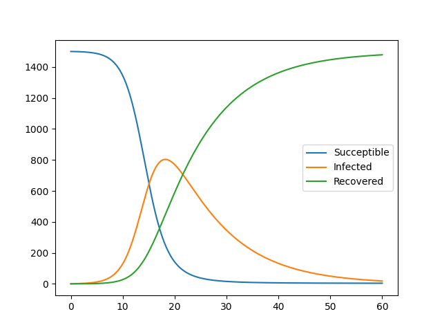
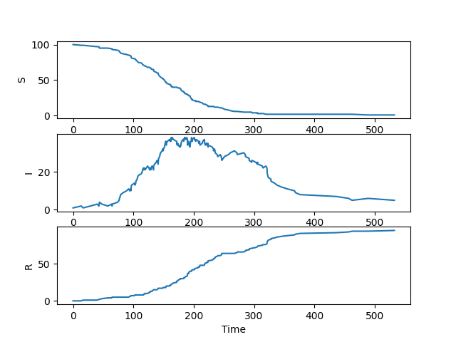
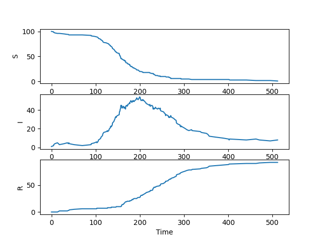

# SIR Epidemiological Model

## Table of Contents
- [Introduction](#introduction)
- [Mathematical Foundation](#mathematical-foundation)
- [Model Variants](#model-variants)
- [Project Structure](#project-structure)
- [Installation](#installation)
- [Usage](#usage)
- [Results and Visualizations](#results-and-visualizations)
- [Theory and Background](#theory-and-background)

## Introduction

The SIR model is a fundamental epidemiological model used to describe the spread of infectious diseases through populations. This project implements both deterministic and stochastic versions of the SIR model, providing comprehensive analysis tools for understanding disease dynamics.

The model divides the population into three compartments:
- **S(t)**: Susceptible individuals who can contract the disease
- **I(t)**: Infected individuals who can transmit the disease
- **R(t)**: Recovered individuals who have immunity

## Mathematical Foundation

### Deterministic SIR Model

The deterministic SIR model is governed by the following system of ordinary differential equations:

```
dS/dt = -βSI/N
dI/dt = βSI/N - γI
dR/dt = γI
```

Where:
- `β` is the transmission rate
- `γ` is the recovery rate (represented as `nu` in the code)
- `N = S + I + R` is the total population (constant)

### Key Parameters

- **Basic Reproduction Number (R₀)**: `R₀ = β/γ`
  - If R₀ > 1, the disease spreads
  - If R₀ < 1, the disease dies out
  - If R₀ = 1, the disease is at equilibrium

- **Contact Rate**: Number of contacts per unit time that could lead to infection
- **Infectious Period**: Average time an individual remains infectious (1/γ)

### Stochastic SIR Model

The stochastic version uses the Gillespie algorithm to simulate individual transmission and recovery events, incorporating randomness in the transmission and recovery processes. This approach accounts for the inherent uncertainty in real-world epidemics and is particularly important for:
- Small populations
- Early stages of epidemics
- Modeling extinction events

## Model Variants

This project implements multiple approaches:

1. **Deterministic ODE Solution** (`sir.py`)
   - Uses custom Forward Euler method for numerical integration
   - Deterministic trajectory analysis
   - Flexible parameter specification (constants or time-dependent functions)

2. **Stochastic Simulation** (`stochastic_model.py`)
   - Gillespie algorithm implementation
   - Event-driven simulation with exponential waiting times
   - Naturally handles population discreteness

3. **Custom ODE Solver** (`ODESOLVER.py`)
   - Object-oriented ODE solver framework
   - Forward Euler method implementation
   - Extensible design for additional numerical methods

## Project Structure

```
SIR_Model/
│
├── sir.py                      # Main deterministic SIR model
├── stochastic_model.py         # Stochastic SIR implementation (Gillespie algorithm)
├── ODESOLVER.py               # Custom ODE solver implementations
├── SIR_Good_Theory.pdf        # Theoretical background document
├── README.md                  # This file
├── .gitignore                # Git ignore file
├── images/                    # Visualization outputs
│   ├── deterministic.png            # Deterministic model results
│   ├── Stochastic1.png       # Stochastic simulation results
│   └── Stochastic2.png       # Additional stochastic analysis
```

## Installation

1. **Clone the repository:**
   ```bash
   git clone https://github.com/zakaria-zoulati/SIR_Model.git
   cd SIR_Model
   ```

2. **Create a virtual environment (recommended):**
   ```bash
   python -m venv sir_env
   source sir_env/bin/activate  # On Windows: sir_env\Scripts\activate
   ```

3. **Install required dependencies:**
   ```bash
   pip install numpy scipy matplotlib pandas seaborn
   ```

## Usage

### Running the Deterministic Model

```python
python sir.py
```

This will generate the deterministic SIR model solution using the Forward Euler method and create visualizations showing the evolution of S, I, and R populations over time.


### Running the Stochastic Model

```python
python stochastic_model.py
```

This performs a single stochastic simulation using the Gillespie algorithm and generates three separate plots for S, I, and R populations.


## Results and Visualizations

### Deterministic Model Results
  
*Deterministic SIR model showing smooth epidemic curves with susceptible (blue), infected (red), and recovered (green) populations using Forward Euler method.*

The deterministic model produces smooth curves showing the classic epidemic progression. The Forward Euler method provides numerical solutions to the SIR system with high temporal resolution.

### Stochastic Model Results
  
*Stochastic SIR model simulation showing step-like trajectories for S, I, and R populations using the Gillespie algorithm.*

  
*Additional stochastic simulation results demonstrating the variability in epidemic trajectories.*

The stochastic model generates step-like trajectories reflecting discrete events (infections and recoveries). Each simulation run produces different results due to the inherent randomness, showing the natural variability in epidemic progression.

**Key Differences:**
- **Deterministic**: Smooth, reproducible curves
- **Stochastic**: Step-like, variable trajectories with possible extinction events

## Theory and Background

### Epidemic Phases

1. **Initial Growth Phase**: Exponential increase in infected individuals
2. **Peak Phase**: Maximum number of infected individuals
3. **Decay Phase**: Decline in infected population as herd immunity develops

### Herd Immunity Threshold

The herd immunity threshold is reached when:
```
S/N < 1/R₀
```

At this point, the effective reproduction number falls below 1, and the epidemic begins to decline.

### Stochastic vs Deterministic Behavior

- **Small Populations**: Stochastic effects dominate, leading to high variability
- **Large Populations**: Deterministic behavior emerges as the law of large numbers applies
- **Extinction Events**: Only possible in stochastic models when infected population reaches zero

### Model Assumptions

- **Homogeneous mixing**: All individuals have equal contact rates
- **Permanent immunity**: Recovered individuals cannot be reinfected
- **Constant population**: No births, deaths, or migration (except disease-related state changes)
- **Instantaneous recovery**: No latent period

### Implementation Details

#### Gillespie Algorithm (Stochastic Model)
The stochastic simulation uses the Gillespie algorithm:
1. Calculate reaction propensities (infection and recovery rates)
2. Draw random time until next event from exponential distribution
3. Randomly select which event occurs based on relative propensities
4. Update population counts and advance time

#### Forward Euler Method (Deterministic Model)
The deterministic model uses the Forward Euler method:
```
u[i+1] = u[i] + dt * f(u[i], t[i])
```
where `f` represents the SIR system of equations.

### Limitations and Extensions

- Real epidemics may require more complex models (SEIR, SEIRS, etc.)
- Spatial heterogeneity and network effects
- Age-structured populations
- Vaccination strategies
- Behavioral changes during epidemics

### Parameter Sensitivity

The model behavior is highly sensitive to the R₀ value:
- With current default parameters: R₀ = β/γ = 0.04/0.01 = 4 (stochastic) vs 0.0004/0.1 = 0.004 (deterministic)
- The stochastic model parameters suggest a spreading epidemic (R₀ > 1)
- The deterministic model parameters suggest epidemic extinction (R₀ < 1)

**Note**: For detailed mathematical derivations and theoretical analysis, please refer to the included `SIR_Good_Theory.pdf` document.